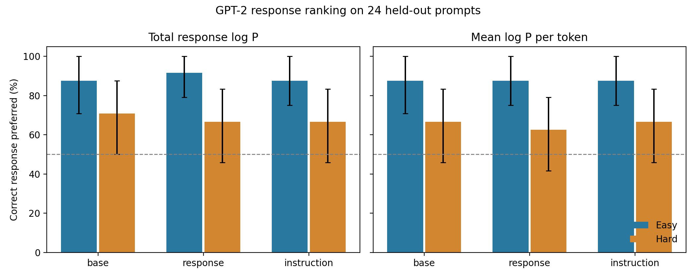

# Results

## Main question

Given an instruction, does the model assign a higher conditional probability to the correct response than to a plausible wrong response?

For each test item, the main comparison is:

\[
P(\text{correct response}\mid\text{instruction}) > P(\text{hard negative}\mid\text{instruction})
\]

## Result table

| Model | Hard negative ranking | Easy negative ranking | Generated-answer success |
|---|---:|---:|---:|
| Pretrained GPT-2 | 16/24 (66.7%) | 21/24 (87.5%) | 0/8 (0%) |
| Response-only tuned | 16/24 (66.7%) | 20/24 (83.3%) | 0/8 (0%) |
| Instruction-tuned | 16/24 (66.7%) | 20/24 (83.3%) | 0/8 (0%) |

## Interpretation

GPT-2 small ranked the supplied correct answer above the hard negative on two thirds of this tiny test set. That behavior was already present before either tuning run.

There was no difference between response-only and instruction tuning on the main ranking measure: both got 16 of 24 items. The sample is too small for a strong conclusion, but it gives no evidence here that one method improved instruction-response matching more than the other.

The generation check was stricter. An answer counted as a success only if it addressed the request and was substantially correct. No output passed both checks. The model often produced repetitive or incomplete text, so supplied-answer ranking was clearly easier than useful generation in this setup.

## Scope

This is a 5–10 minute proof of concept: one seed, GPT-2 small, 24 ranking items, 8 generations, and one epoch of tuning. The LLM graded the hard negatives and generated answers; these judgments are recorded in the repository. The result should be read as a small demonstration and not as a reproduction of the 7B LIMA experiment in Hewitt et al.

For the full metric table and bootstrap intervals, see [the generated note](artifacts-poc/report/note.md) and [results JSON](artifacts-poc/report/results.json).
